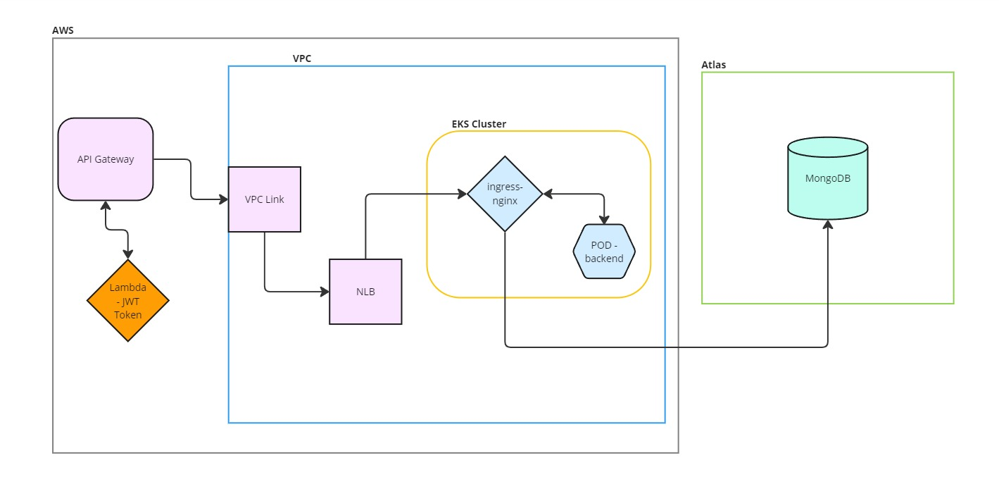
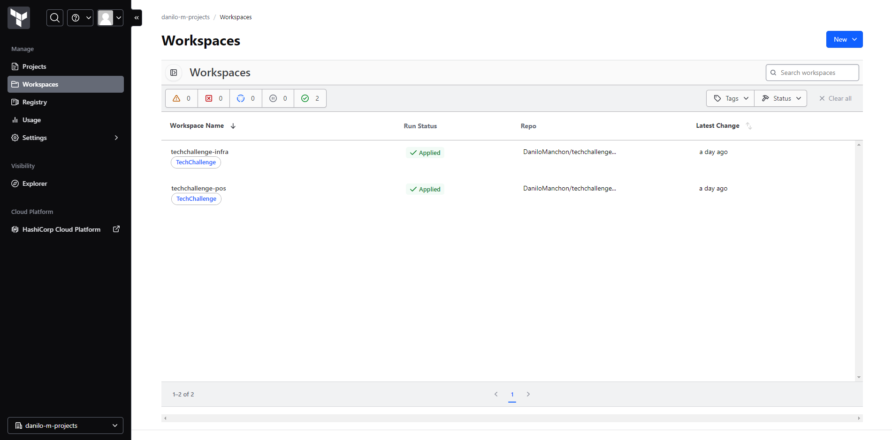

# techchallenge-infra
Repositório de infraestrutura para a solução Techchallenge

## Diagrama de Arquitetura:

A arquitetura foi pensada para usar como base um cluster Kubernetes, utilizando a ferramenta Amazon Elastic Kubernetes Service (Amazon EKS), configurado em uma Amazon Virtual Private Cloud (Amazon VPC) própria. A solução conta com um Network Load Balancer (NLB) orquestrado pelo proxy reverso [Ingress-Nginx](https://github.com/kubernetes/ingress-nginx).
Tal sistema de proxy reverso permite que várias instâncias rodem de forma simultânea e independente, distribuir a carga de forma eficiente entre elas.

Para a nossa solução, usamos um banco de dados NoSQL MongoDB, cuja hospedagem é realizada em um sistema de nuvem própria chamada [Atlas](https://www.mongodb.com/products/platform/cloud).

## Terraform e Helm
Como uma forma de facilitar a manutenção e a atualização de recursos na nossa infraestrutura, utilizamos o Terraform como IAC (_Infrastructure as Code_) e o [Helm](https://helm.sh/) para a instalação de nossos recursos dentro do cluster kubernetes.

Nossas pipelines de implantação foram configuradas no [HCP Terraform](https://app.terraform.io/session) para termos uma maior simplicidade quanto as configurações de acesso a conta AWS e são ativadas automaticamente quando ocorre algum push na branch _main_ de cada projeto.

## Banco de dados
O MongoDB foi escolhido como banco de dados principal para a solução, pelos seguintes motivos:
- Flexibilidade na modelagem de dados: por ser baseado em documentos BSON (Binary JSON), temos muita flexibilidade em estruturar o que será armazenado.
- Escalabilidade: Caso seja necessario, o MongoDB tem alto poder de escalabilidade e pode ser distribuido em multiplas instancias.
- Performance: Alem de ser conhecido por sua alta performance em operações de leitura e gravação, ainda é possivel termos indexação em qualquer campo do documento, o que acelera ainda mais a velocidade das consultas, mesmo que sejam complexas.
- (Bonus) Academico: Nunca havia trabalhado com bancos de dados NoSQL e aproveitei a oportunidade para me desafiar e aprender uma nova tecnologia.

## Próximos Passos
Finalização da integração do API Gateway com Lambda: Implementar a autenticação de forma funcional.
